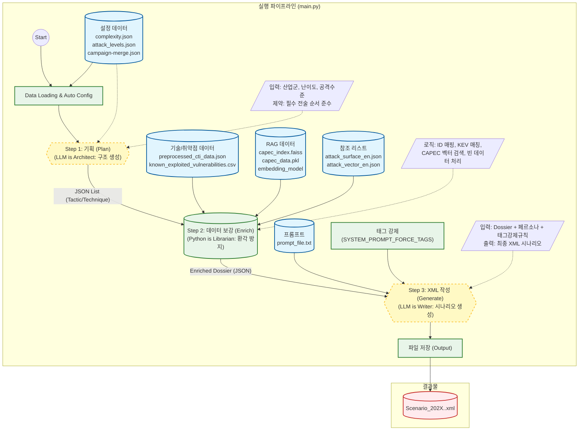

```mermaid
graph TD
    %% 스타일 정의
    classDef file fill:#e1f5fe,stroke:#01579b,stroke-width:2px;
    classDef llm fill:#fff9c4,stroke:#fbc02d,stroke-width:2px,stroke-dasharray: 5 5;
    classDef python fill:#e8f5e9,stroke:#2e7d32,stroke-width:2px;
    classDef output fill:#ffebee,stroke:#c62828,stroke-width:2px;


        ConfigFiles[("설정 데이터<br>complexity.json<br>attack_levels.json<br>campaign-merge.json")]:::file
        CTIFiles[("기술/취약점 데이터<br>preprocessed_cti_data.json<br>known_exploited_vulnerabilities.csv")]:::file
        RAGFiles[("RAG 데이터<br>capec_index.faiss<br>capec_data.pkl<br>embedding_model")]:::file
        PromptFile[("프롬프트<br>prompt_file.txt")]:::file
        RefLists[("참조 리스트<br>attack_surface_en.json<br>attack_vector_en.json")]:::file


    subgraph Pipeline ["실행 파이프라인 (main.py)"]
        
        %% Step 0
        Start((Start)) --> Load[Data Loading & Auto Config]:::python
        ConfigFiles --> Load
        
        %% Step 1
        Load --> Step1_Plan{{"Step 1: 기획 (Plan)<br>(LLM is Architect: 구조 생성)"}}:::llm
        ConfigFiles -.-> Step1_Plan
        note1[/"입력: 산업군, 난이도, 공격수준<br>제약: 필수 전술 순서 준수"/] -.-> Step1_Plan

        %% Step 2
        Step1_Plan --"JSON List (Tactic/Technique)"--> Step2_Enrich[("Step 2: 데이터 보강 (Enrich)<br>(Python is Librarian: 환각 방지)")]:::python
        CTIFiles --> Step2_Enrich
        RAGFiles --> Step2_Enrich
        RefLists --> Step2_Enrich
        note2[/"로직: ID 매핑, KEV 매칭,<br>CAPEC 벡터 검색, 빈 데이터 처리"/] -.-> Step2_Enrich

        %% Step 3
        Step2_Enrich --"Enriched Dossier (JSON)"--> Step3_Gen{{"Step 3: XML 작성 (Generate)<br>(LLM is Writer: 시나리오 생성)"}}:::llm
        PromptFile --> Step3_Gen
        CodeRule["태그 강제<br>(SYSTEM_PROMPT_FORCE_TAGS)"]:::python --> Step3_Gen
        note3[/"입력: Dossier + 페르소나 + 태그강제규칙<br>출력: 최종 XML 시나리오"/] -.-> Step3_Gen

        %% Step 4
        Step3_Gen --> Save["파일 저장 (Output)"]:::python
    end

    subgraph Result [결과물]
        FinalXML[("Scenario_202X..xml")]:::output
    end

    Save --> FinalXML
```