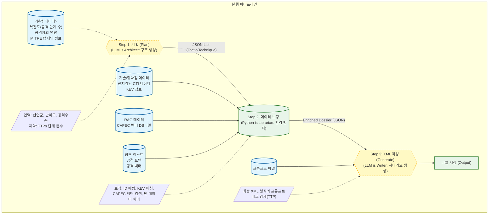

```mermaid
graph TD
    %% 스타일 정의
    classDef file fill:#e1f5fe,stroke:#01579b,stroke-width:2px;
    classDef llm fill:#fff9c4,stroke:#fbc02d,stroke-width:2px,stroke-dasharray: 5 5;
    classDef python fill:#e8f5e9,stroke:#2e7d32,stroke-width:2px;
    classDef output fill:#ffebee,stroke:#c62828,stroke-width:2px;

        ConfigFiles[("<설정 데이터><br>복잡도(공격 단계 수)<br>공격자의 역량<br>MITRE 캠페인 정보")]:::file
        CTIFiles[("기술/취약점 데이터<br>전처리된 CTI 데이터<br>KEV 정보")]:::file
        RAGFiles[("RAG 데이터<br>CAPEC 벡터 DB파일")]:::file
        PromptFile[("프롬프트 파일")]:::file
        RefLists[("참조 리스트<br>공격 표면<br>공격 벡터")]:::file

    subgraph Pipeline ["실행 파이프라인"]
        
        %% Step 1
        Step1_Plan{{"Step 1: 기획 (Plan)<br>(LLM is Architect: 구조 생성)"}}:::llm
        ConfigFiles -.-> Step1_Plan
        note1[/"입력: 산업군, 난이도, 공격수준<br>제약: TTPs 단계 준수"/] -.-> Step1_Plan

        %% Step 2
        Step1_Plan --"JSON List (Tactic/Technique)"--> Step2_Enrich[("Step 2: 데이터 보강 <br>(Python is Librarian: 환각 방지)")]:::python
        CTIFiles --> Step2_Enrich
        RAGFiles --> Step2_Enrich
        RefLists --> Step2_Enrich
        note2[/"로직: ID 매핑, KEV 매칭,<br>CAPEC 벡터 검색, 빈 데이터 처리"/] -.-> Step2_Enrich

        %% Step 3
        Step2_Enrich --"Enriched Dossier (JSON)"--> Step3_Gen{{"Step 3: XML 작성 (Generate)<br>(LLM is Writer: 시나리오 생성)"}}:::llm
        PromptFile --> Step3_Gen
        note3[/"최종 XML 형식의 프롬프트<br>태그 강제(TTP)"/] -.-> Step3_Gen

        %% Step 4
        Step3_Gen --> Save["파일 저장 (Output)"]:::python
    end
```